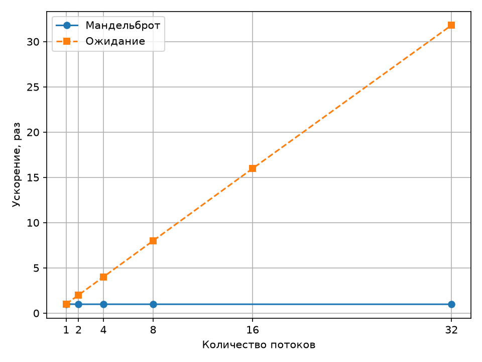

## Практическая №3. Потоки

Процессор: AMD64 Family 26 Model 68 Stepping 0, AuthenticAMD.  
Логических процессоров: 32. Python: 3.14.0. GIL включён.  
Размер: 1500 × 1000. MAX_ITER: 300. Прогонов: 3.

Время измерил через `time.perf_counter()`. В потоковых версиях в замер входят создание пула, выполнение задач и завершение пула.

Ускорение = минимум последовательной версии / минимум потоковой версии. Для каждой задачи своя последовательная база.

### Мандельброт

| Потоки | Прогон 1, с | Прогон 2, с | Прогон 3, с | Минимум, с | Ускорение |
|---|---:|---:|---:|---:|---:|
| Последовательно | 8,162817 | 8,065967 | 8,046694 | 8,046694 | 1,000 |
| 2 | 8,203615 | 8,239449 | 8,217946 | 8,203615 | 0,981 |
| 4 | 8,193665 | 8,268761 | 8,322258 | 8,193665 | 0,982 |
| 8 | 8,480824 | 8,300148 | 8,198613 | 8,198613 | 0,981 |
| 32 | 8,275622 | 8,222289 | 8,243355 | 8,222289 | 0,979 |

### CPU / wall: 8 потоков

Получилось 0,996; 1,024; 1,015 — средняя занятость примерно одного логического процессора. CPU измерил через `time.process_time()`, wall — через `time.perf_counter()` в тех же запусках.

### Ожидание

32 задачи по 0,5 с через `time.sleep()`.

| Потоки | Прогон 1, с | Прогон 2, с | Прогон 3, с | Минимум, с | Ускорение |
|---|---:|---:|---:|---:|---:|
| Последовательно | 16,010118 | 16,010009 | 16,010912 | 16,010009 | 1,000 |
| 2 | 8,006742 | 8,005275 | 8,005359 | 8,005275 | 2,000 |
| 4 | 4,003381 | 4,004015 | 4,003207 | 4,003207 | 3,999 |
| 8 | 2,002425 | 2,002321 | 2,002764 | 2,002321 | 7,996 |
| 16 | 1,002851 | 1,002187 | 1,002537 | 1,002187 | 15,975 |
| 32 | 0,504249 | 0,503489 | 0,503356 | 0,503356 | 31,807 |

Проверки `assert r == base` прошли для всех вариантов.

### График

1 на графике — последовательная версия без пула.
