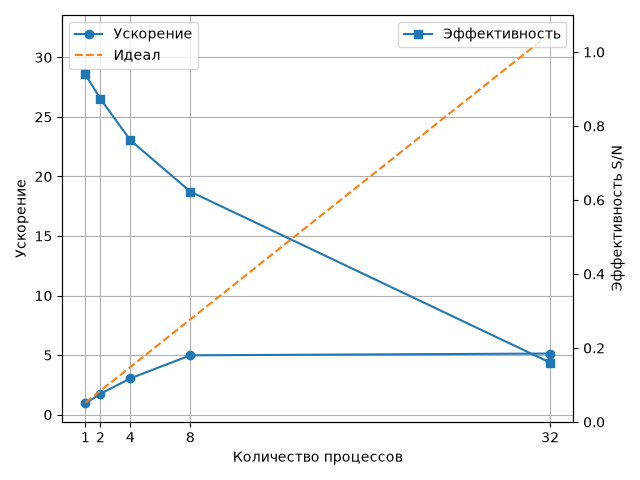

# Висновки

Послідовне виконання: 8,042 с.

Найкращий час отримано при 32 процесах — 1,568 с, прискорення ×5,129. При 8 процесах час був 1,615 с, прискорення ×4,981.

Розрив від ідеального прискорення можна пояснити трьома причинами:

1. Накладні витрати процесів. Один процес через `ProcessPoolExecutor` працював 8,563 с, тобто повільніше за послідовну версію 8,042 с.
2. Передача даних між процесами теж має витрати. Через це ефективність зменшується: 0,873 для 2 процесів, 0,761 для 4 і 0,623 для 8.
3. У комп'ютері 16 фізичних і 32 логічних ядра. Перехід від 8 до 32 процесів майже не покращив час: 1,615 с → 1,568 с, а ефективність впала до 0,160.

Отже, збільшення кількості процесів після певного моменту майже не дає виграшу.

## Графік

